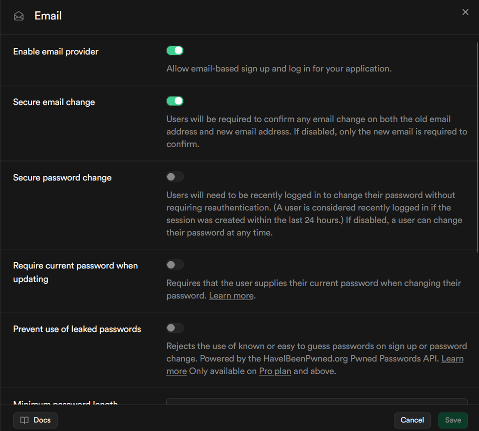
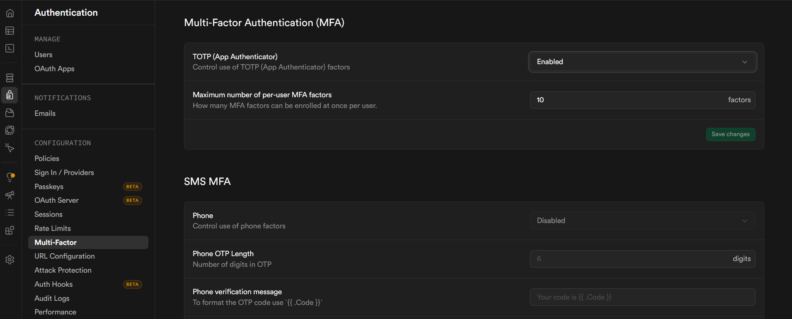
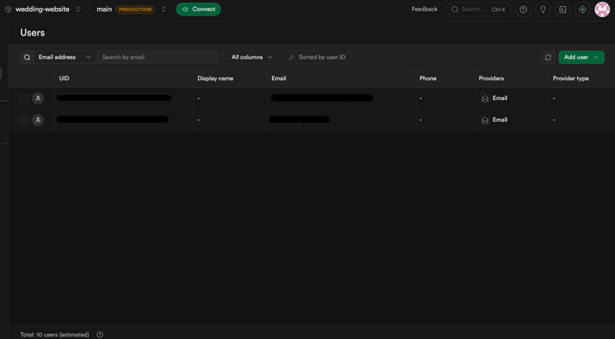
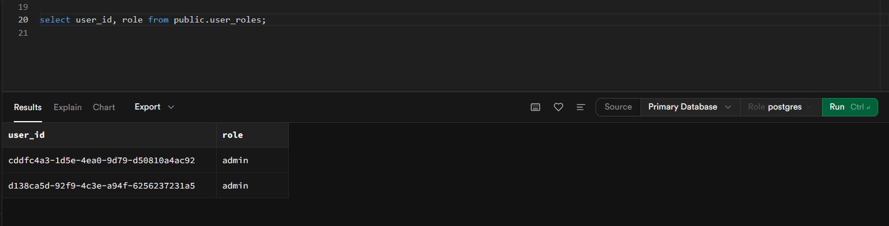
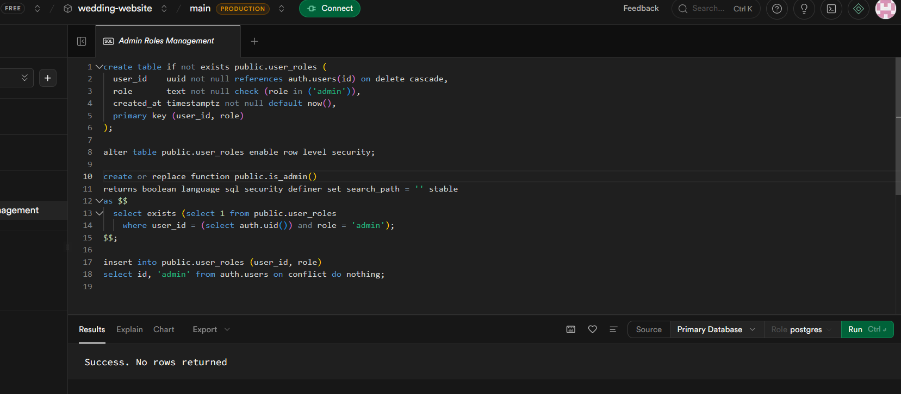
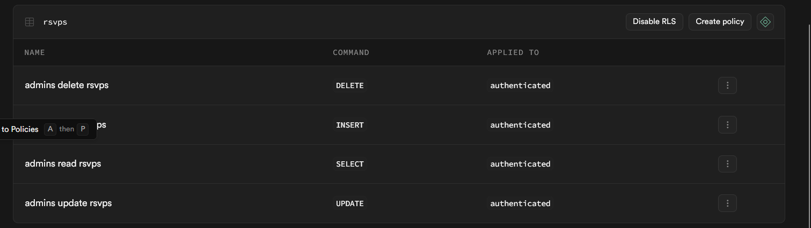
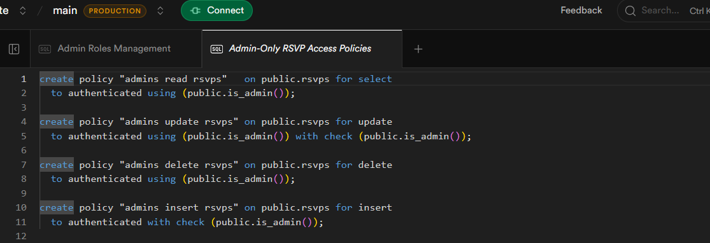
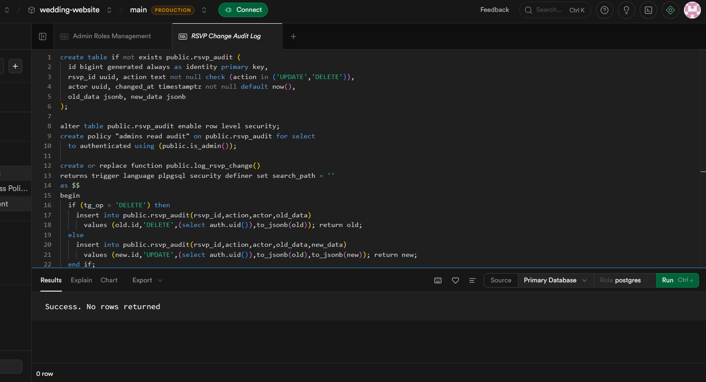
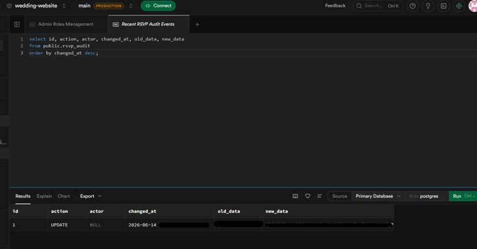

# Case Study — Hardening a Live AI-Built Wedding Site

How a quick, AI-generated RSVP site was taken from **shared-password admin + a hardcoded secret** to **identity-based RBAC, MFA, row-level authorization, and an audit trail** — without ever taking the live site down or exposing the ~60 guests' personal data.

> Sanitized: no secrets, no guest data. Screenshots are redacted where needed.

---

## The app

| | |
|---|---|
| What | Wedding RSVP / interest-gauge site, live in production |
| Stack | Next.js 16 (App Router) · Supabase (Postgres) · Vercel |
| Data | ~30 submissions / ~60 guests — names, emails, **home addresses**, dietary notes |
| Origin | Built fast with AI assistance |

## Threat model

- **Crown jewel:** guest PII. **Confidentiality is goal #1**, integrity #2, availability #3.
- **Primary adversary:** an opportunistic remote attacker — probes public endpoints, reads the client bundle, tries weak/default admin auth.
- **Out of scope (for this design):** nation-state, physical access, large-scale DDoS, cloud-provider insider.

---

## The "before" — what the AI build shipped

A security review (Supabase advisor + manual reading) found the classic AI-codegen pattern:

1. 🔴 **Hardcoded secret** inside a database function (`admin_list_rsvps`) — combined with a publicly-callable RPC, anyone with the publishable key + that string could **dump every guest's name, email, and address**.
2. 🟠 **Admin = one shared password.** No individual identity, no MFA, no accountability.
3. 🟠 **RLS enabled but zero policies** — security was "on" but did nothing; all access leaned on the secret-guarded functions.
4. 🟠 **SECURITY DEFINER functions with mutable `search_path`** — a privilege-escalation vector.
5. 🟠 **No audit trail** — no record of who edited or deleted a record.

---

## The work — 6 phases, each mapped to a control domain

Every change was **additive and staged** so the live site kept working the whole way; the app cutover was tested on a preview deployment before going live.

### Phase 1 — Harden functions · *Domain 3 (secrets), 8 (verification)*
Pinned `search_path` on the privileged functions and removed a duplicate. Cleared the advisor's `function_search_path_mutable` findings.
**Principle:** a `SECURITY DEFINER` routine must pin its `search_path`, or an attacker can shadow objects and run code with elevated rights.
<!--  -->

### Phase 2 — Real identity + MFA · *Domain 1 (identity & access)*
Replaced the shared password with **Supabase Auth** — individual accounts for the two owners, public sign-ups **disabled**, **TOTP MFA** required.
**Principle:** authentication proves *who*; MFA assumes the password will leak. TOTP chosen over SMS (free + stronger; NIST 800-63B deprecates SMS).

### Phase 3 — Role model · *Domain 1 (authorization)*
Added a `user_roles` table + an `is_admin()` helper (locked table, `SECURITY DEFINER`, pinned `search_path`). Seeded the two owners as `admin`.
**Principle:** roles live apart from accounts — the "R" in RBAC. The roles table is locked so no one can self-grant admin.

### Phase 4 — Row-level authorization · *Domain 2 (data authz)*
Added RLS policies so **only signed-in admins** (`is_admin()`) can read/edit/delete RSVPs; the public RSVP path stays open. Cleared the "RLS enabled, no policy" finding.
**Principle:** enforce access at the data layer, not just the UI. Deny by default.

### Phase 5 — Audit log · *Domain 5 (auditability)*
Added an append-only `rsvp_audit` table + trigger logging **who / what / when** on every edit and delete.
**Principle:** the "Accounting" leg of AAA. An audit log must be append-only to be trustworthy.

### Phase 6 — App cutover · *Domains 1, 3, 7*
Built a real login (email + password + TOTP), made the admin pages operate on the **user's session** (RLS-governed), deployed, then **deleted** the shared password, the RPC secret, the legacy routes, and the **hardcoded secret**.
**Principle:** retire the old path entirely — a fallback door is still a door.
<!--  -->

---

## Proof it works

- **Access gate:** with no session, `/admin` redirects to login and serves **no** data (verified by clearing the session cookie and re-requesting).
- **Accountability:** before, an edit logged `actor = NULL`; after the cutover, the same edit through the real login logged `actor = <the admin's id>`. Same action, now attributable.
- **Advisor:** post-migration scan shows only **intentional** items (locked tables) and **Pro-only** features.

---

## Before → After

| | Before (AI build) | After |
|---|---|---|
| Admin auth | one shared password | individual logins + **TOTP MFA** |
| Secret | **hardcoded in DB function** | **eliminated** |
| Data access | RLS on, **no policies** | **admin-only RLS** |
| Accountability | none | **audit log** (who/what/when) |
| Functions | mutable `search_path` | pinned |
| Identity | none | Supabase Auth |

## Framework mapping
- **NIST CSF 2.0:** PR.AA-01/05 (identity, access control), DE.* (detect, via the audit log)
- **NIST 800-53:** AC-2/3/6 (account mgmt, enforcement, least privilege), IA-2 (MFA), IA-5 (secret rotation), AU-2/3 (audit)

## What's next
- **Monitoring & detection (Domain 9):** ship Vercel + Supabase + audit logs to a SIEM (Axiom free tier / self-hosted Wazuh); alert on failed admin logins.
- **Leaked-password protection:** enable Supabase's HaveIBeenPwned check (Pro tier).
